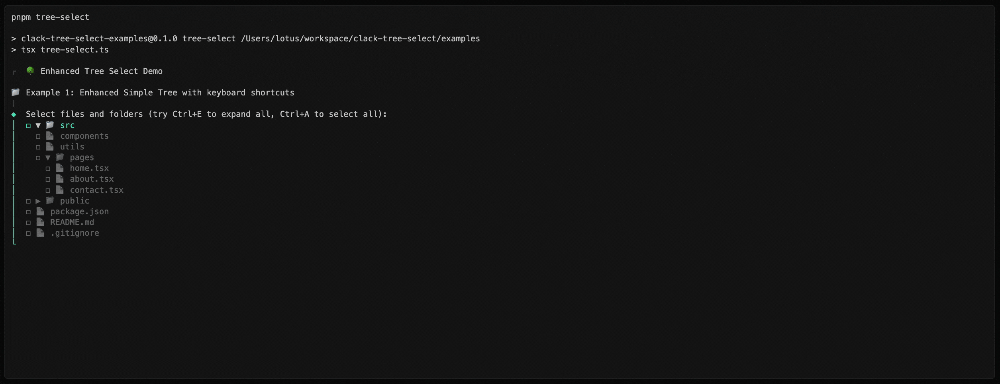

# 🌳 clack-tree-select

[](https://badge.fury.io/js/clack-tree-select)
[](https://npmjs.com/package/clack-tree-select)
[](https://github.com/yourusername/clack-tree-select/blob/main/LICENSE)

<div align="center">
  <h3>💖 Sponsored by</h3>
  <h4>Stringer CLI</h4>
  <p><strong>"Make your React & Vue apps multilingual in minutes!"</strong></p>
  
  <br>
  <a href="https://stringer-cli.com">Learn more about Stringer CLI →</a>
</div>

---

Beautiful, interactive tree selection prompts for command-line applications. Built on top of [Clack](https://github.com/bombshell-dev/clack) for the best CLI experience.

## 🎬 Demo



[**▶️ Watch Demo on Asciinema**](https://asciinema.org/a/UaV0pOtfI5BGgcc0m8xAqNfW6)

> See navigation, hierarchical selection, and smart keyboard shortcuts in action.

## ✨ Features

- 🌳 **Hierarchical Selection** - Select parent directories to select all children
- ⌨️ **Smart Keyboard Shortcuts** - Intuitive navigation with toggle expand/select all
- 🎨 **Customizable Styling** - Beautiful icons and colors that match your brand
- 🚀 **Performance Optimized** - Efficient rendering for large directory trees  
- 📱 **TypeScript Ready** - Full type safety with excellent IntelliSense
- 🔧 **File System Integration** - Built-in support for browsing local directories
- ✅ **Validation Support** - Custom validation with helpful error messages

## 📦 Installation

```bash
npm install clack-tree-select
```

```bash
yarn add clack-tree-select
```

```bash
pnpm add clack-tree-select
```

## 🚀 Quick Start

Add tree selection to your existing Clack CLI:

```typescript
import { treeSelect } from 'clack-tree-select';
import { intro, outro, text, isCancel } from '@clack/prompts';

async function main() {
  intro('🚀 Project Setup');

  // Your existing Clack prompts
  const projectName = await text({
    message: 'Project name?',
    placeholder: 'my-project'
  });

  if (isCancel(projectName)) return;

  // Add tree selection seamlessly
  const files = await treeSelect({
    message: 'Select files to process:',
    tree: [
      {
        value: 'src',
        name: 'src',
        children: [
          { value: 'src/components', name: 'components' },
          { value: 'src/pages', name: 'pages' },
          { value: 'src/utils', name: 'utils' }
        ]
      },
      { value: 'package.json', name: 'package.json' }
    ]
  });

  if (isCancel(files)) return;

  outro(`✅ ${projectName}: Selected ${files.length} files`);
}

main();
```

**Perfect integration** - works alongside all your existing Clack prompts! 🎯

## 🌲 Beyond Files: Any Tree Data Structure

While `clack-tree-select` works great with file systems, **it's designed as a generic tree selection tool**. You can create hierarchical selection prompts for any data structure! Here are some powerful examples:

### 🎨 UI Component Library Selection

```typescript
const components = await treeSelect({
  message: 'Select UI components to include:',
  tree: [
    {
      value: 'forms',
      name: 'Form Components',
      children: [
        { value: 'forms/input', name: 'Text Input' },
        { value: 'forms/select', name: 'Select Dropdown' },
        { value: 'forms/checkbox', name: 'Checkbox' },
        { value: 'forms/radio', name: 'Radio Button' }
      ]
    },
    {
      value: 'navigation',
      name: 'Navigation',
      children: [
        { value: 'nav/header', name: 'Header' },
        { value: 'nav/sidebar', name: 'Sidebar' },
        { value: 'nav/breadcrumb', name: 'Breadcrumb' },
        { value: 'nav/pagination', name: 'Pagination' }
      ]
    },
    {
      value: 'feedback',
      name: 'Feedback',
      children: [
        { value: 'feedback/alert', name: 'Alert' },
        { value: 'feedback/toast', name: 'Toast' },
        { value: 'feedback/modal', name: 'Modal' },
        { value: 'feedback/tooltip', name: 'Tooltip' }
      ]
    }
  ]
});
```

### 🏢 Organization/Department Structure

```typescript
interface Department {
  id: string;
  name: string;
  manager?: string;
}

const departments = await treeSelect<Department>({
  message: 'Select departments for the training program:',
  tree: [
    {
      value: { id: 'eng', name: 'Engineering', manager: 'Alice' },
      name: 'Engineering',
      children: [
        { value: { id: 'frontend', name: 'Frontend' }, name: 'Frontend Team' },
        { value: { id: 'backend', name: 'Backend' }, name: 'Backend Team' },
        { value: { id: 'devops', name: 'DevOps' }, name: 'DevOps Team' }
      ]
    },
    {
      value: { id: 'product', name: 'Product', manager: 'Bob' },
      name: 'Product',
      children: [
        { value: { id: 'design', name: 'Design' }, name: 'Design Team' },
        { value: { id: 'pm', name: 'Product Management' }, name: 'Product Managers' },
        { value: { id: 'research', name: 'User Research' }, name: 'Research Team' }
      ]
    }
  ]
});
```

### 🛍️ E-commerce Category Selection

```typescript
const categories = await treeSelect({
  message: 'Select product categories to feature:',
  tree: [
    {
      value: 'electronics',
      name: 'Electronics',
      children: [
        {
          value: 'computers',
          name: 'Computers',
          children: [
            { value: 'laptops', name: 'Laptops' },
            { value: 'desktops', name: 'Desktops' },
            { value: 'tablets', name: 'Tablets' }
          ]
        },
        {
          value: 'phones',
          name: 'Mobile Phones',
          children: [
            { value: 'smartphones', name: 'Smartphones' },
            { value: 'accessories', name: 'Phone Accessories' }
          ]
        }
      ]
    },
    {
      value: 'clothing',
      name: 'Clothing',
      children: [
        { value: 'mens', name: "Men's Clothing" },
        { value: 'womens', name: "Women's Clothing" },
        { value: 'kids', name: "Kids' Clothing" }
      ]
    }
  ]
});
```

### 📋 Feature/Permission Selection

```typescript
interface Permission {
  id: string;
  scope: string;
  level: 'read' | 'write' | 'admin';
}

const permissions = await treeSelect<Permission>({
  message: 'Select permissions for this role:',
  tree: [
    {
      value: { id: 'users', scope: 'users', level: 'admin' },
      name: 'User Management',
      children: [
        { 
          value: { id: 'users-read', scope: 'users', level: 'read' }, 
          name: 'View Users' 
        },
        { 
          value: { id: 'users-write', scope: 'users', level: 'write' }, 
          name: 'Edit Users' 
        },
        { 
          value: { id: 'users-admin', scope: 'users', level: 'admin' }, 
          name: 'Manage Users' 
        }
      ]
    },
    {
      value: { id: 'content', scope: 'content', level: 'admin' },
      name: 'Content Management',
      children: [
        { 
          value: { id: 'content-read', scope: 'content', level: 'read' }, 
          name: 'View Content' 
        },
        { 
          value: { id: 'content-write', scope: 'content', level: 'write' }, 
          name: 'Edit Content' 
        }
      ]
    }
  ]
});
```

### 🎯 Key Benefits for Non-File Data

- **Type Safety**: Full TypeScript support with custom data types
- **Flexible Values**: Use strings, objects, numbers, or any data type as values
- **Custom Display**: `name` property controls what users see, `value` is what you get back
- **Rich Hierarchies**: Create deep, meaningful organizational structures
- **Batch Selection**: Select entire categories and all children automatically

The generic `TreeItem<T>` interface makes it perfect for any hierarchical data structure in your applications!

## 📚 API Reference

### `treeSelect(options)`

Creates an interactive tree selection prompt.

#### Options

| Option | Type | Default | Description |
|--------|------|---------|-------------|
| `message` | `string` | **required** | The prompt message to display |
| `tree` | `TreeItem[]` | **required** | The tree structure to display |
| `multiple` | `boolean` | `true` | Allow multiple selections |
| `initialValues` | `T[]` | `[]` | Pre-selected values |
| `required` | `boolean` | `false` | Require at least one selection |
| `maxItems` | `number` | `undefined` | Maximum visible items (scrolling) |
| `icons` | `IconOptions` | default icons | Custom icons for tree items |
| `showHelp` | `boolean` | `true` | Show keyboard shortcuts in validation |

#### TreeItem Interface

```typescript
interface TreeItem<T = any> {
  value: T;              // Unique identifier
  name?: string;         // Display name (falls back to value)
  open?: boolean;        // Initially expanded
  children?: TreeItem<T>[] | string[] | T[];  // Child items
}
```

#### Icon Options

```typescript
interface IconOptions {
  directory?: string;    // Default: '📁'
  file?: string;         // Default: '📄'  
  expanded?: string;     // Default: '▼'
  collapsed?: string;    // Default: '▶'
}
```

### `fileSystemTreeSelect(options)`

Creates a tree selection prompt from a file system directory.

```typescript
const files = await fileSystemTreeSelect({
  message: 'Select files from your project:',
  root: './src',
  includeFiles: true,
  includeHidden: false,
  maxDepth: 3,
  filter: (path) => !path.includes('node_modules')
});
```

## ⌨️ Keyboard Shortcuts

| Shortcut | Action |
|----------|--------|
| `↑` / `↓` | Navigate up/down |
| `←` / `→` | Collapse/expand directory |
| `Space` | Toggle selection |
| `Shift+E` | Toggle expand/collapse all |
| `Shift+A` | Toggle select/deselect all |
| `Enter` | Submit selection |
| `Ctrl+C` | Cancel prompt |

## 🎯 Advanced Examples

### Custom Icons and Styling

```typescript
const result = await treeSelect({
  message: 'Choose components to generate:',
  tree: components,
  icons: {
    directory: '📂',
    file: '⚛️',
    expanded: '📂', 
    collapsed: '📁'
  },
  multiple: true,
  required: true
});
```

### Single Selection Mode

```typescript
const configFile = await treeSelect({
  message: 'Choose a configuration file:',
  tree: [
    {
      value: 'config',
      name: 'config',
      open: true,
      children: [
        { value: 'tsconfig.json', name: 'TypeScript Config' },
        { value: 'package.json', name: 'Package Config' },
        { value: 'vite.config.js', name: 'Vite Config' }
      ]
    }
  ],
  multiple: false,
  required: true
});
```

> **Note**: In single selection mode, only leaf nodes (files without children) can be selected. Parent directories are shown but not selectable, ensuring users select actual items rather than containers.

### File System Integration

```typescript
import { fileSystemTreeSelect } from 'clack-tree-select';

const selectedFiles = await fileSystemTreeSelect({
  message: 'Select files to process:',
  root: process.cwd(),
  includeFiles: true,
  includeHidden: false,
  maxDepth: 3,
  filter: (path) => {
    // Exclude common non-source directories
    return !path.includes('node_modules') && 
           !path.includes('.git') && 
           !path.includes('dist');
  }
});
```

### Custom Validation

```typescript
const result = await treeSelect({
  message: 'Select at least 2 components:',
  tree: componentTree,
  validate: (selected) => {
    if (!selected || selected.length < 2) {
      return 'Please select at least 2 components to continue.';
    }
  }
});
```

## 🔧 Integration Examples

### With Package Managers

```typescript
// Ask user to select packages to install
const packages = await treeSelect({
  message: 'Select packages to install:',
  tree: [
    {
      value: 'react',
      name: 'React',
      children: [
        { value: 'react-dom', name: 'React DOM' },
        { value: 'react-router', name: 'React Router' }
      ]
    },
    {
      value: 'build-tools',
      name: 'Build Tools',
      children: [
        { value: 'vite', name: 'Vite' },
        { value: 'typescript', name: 'TypeScript' }
      ]
    }
  ]
});
```

### With Monorepos

```typescript
// Select packages in a monorepo
const workspaces = await fileSystemTreeSelect({
  message: 'Select workspaces to build:',
  root: './packages',
  includeFiles: false,  // Only directories
  maxDepth: 1,
  filter: (path) => {
    // Only include directories with package.json
    return fs.existsSync(`${path}/package.json`);
  }
});
```

## 🎨 Theming

The tree select automatically adapts to your terminal's color scheme and follows Clack's beautiful styling conventions:

- **Selected items**: Green checkboxes (◼)
- **Unselected items**: Gray checkboxes (◻)  
- **Active item**: Cyan highlighting
- **Directories**: Folder icons with expand/collapse indicators
- **Files**: Document icons

## 🔗 Integration with Existing Clack CLIs

This package is designed as a **drop-in addition** to your existing Clack CLI. No changes needed to your current setup!

```typescript
// Your existing CLI
import { intro, text, select, multiselect, outro } from '@clack/prompts';
// Just add this import ↓
import { treeSelect } from 'clack-tree-select';

async function myCLI() {
  intro('My Existing CLI');
  
  const name = await text({ message: 'Project name?' });
  const framework = await select({ /* ... */ });
  
  // New: Add tree selection anywhere in your flow
  const files = await treeSelect({
    message: 'Select files to process:',
    tree: myFileTree
  });
  
  const tools = await multiselect({ /* ... */ });
  outro('Done!');
}
```

**Zero breaking changes** - just add `treeSelect` where you need hierarchical selection!

## 🧪 Examples

Check out the [`examples/`](examples/) directory for interactive demos:

```bash
cd examples
pnpm install

# Basic tree-select functionality
pnpm tree-select

# Complete integration with other Clack prompts
pnpm integration
```

The integration demo shows a real CLI workflow mixing `treeSelect` with `text`, `select`, `multiselect`, and `confirm` prompts.

## 🤝 Contributing

We welcome contributions! Please see our [Contributing Guide](CONTRIBUTING.md) for details.

1. Fork the repository
2. Create your feature branch (`git checkout -b feature/amazing-feature`)
3. Commit your changes (`git commit -m 'Add some amazing feature'`)
4. Push to the branch (`git push origin feature/amazing-feature`)
5. Open a Pull Request

## 📝 License

This project is licensed under the MIT License - see the [LICENSE](LICENSE) file for details.

---

<div align="center">
  <p>Made with ❤️ for the CLI community</p>
  <p>
    <a href="https://github.com/titusdecali/clack-tree-select">GitHub</a> •
    <a href="https://npmjs.com/package/clack-tree-select">NPM</a> •
    <a href="https://github.com/titusdecali/clack-tree-select/issues">Issues</a>
  </p>
</div>
